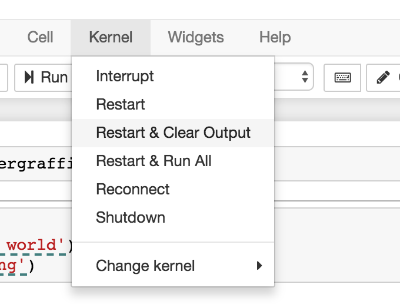

# Jupyter Graffiti

Create interactive screencasts inside Jupyter Notebook that anybody can play back.


Ever wanted to offer someone a hands-on "live" demo in Jupyter
Notebook? Using __Graffiti__ you can add floating tips along with
optional recorded movies ("*Graffiti*") anywhere in your
Notebooks. Demonstrate whatever you want, highlight what's important--
and it's narrated by you!  Since the movie plays back in _and on_ the
Notebook, the viewer can pause any time and try things out exactly as
you had them when you were recording, and then resume any time.

## Try Graffiti with these _Live_ Demos:

* [](https://mybinder.org/v2/gh/willkessler/jupytergraffiti/master?filepath=samples%2Fgeneral%2FGraffiti%20Basic%20Demo.ipynb) <a href="https://mybinder.org/v2/gh/willkessler/jupytergraffiti/master?filepath=samples%2Fgeneral%2FGraffiti%20Basic%20Demo.ipynb">General Demo</a>
* [](https://mybinder.org/v2/gh/willkessler/jupytergraffiti/master?filepath=samples%2Fudacity%2Fc%2B%2B_nanodegree%2FFor%20Loops.ipynb) <a href="https://mybinder.org/v2/gh/willkessler/jupytergraffiti/master?filepath=samples%2Fudacity%2Fc%2B%2B_nanodegree%2FFor%20Loops.ipynb">Udacity C++ Nanodegree Example: "For Loops"</a>
* [](https://mybinder.org/v2/gh/willkessler/jupytergraffiti/master?filepath=samples%2Fudacity%2Fc%2B%2B_nanodegree%2FPointers.ipynb) <a href="https://mybinder.org/v2/gh/willkessler/jupytergraffiti/master?filepath=samples%2Fudacity%2Fc%2B%2B_nanodegree%2FPointers.ipynb">Udacity C++ Nanodegree Example: "Pointers"</a>
* [](https://mybinder.org/v2/gh/willkessler/jupytergraffiti/master?filepath=samples%2Fudacity%2Fdata_structures_nanodegree%2FImplement%20a%20stack%20using%20an%20array.ipynb) <a href="https://mybinder.org/v2/gh/willkessler/jupytergraffiti/master?filepath=samples%2Fudacity%2Fdata_structures_nanodegree%2FImplement%20a%20stack%20using%20an%20array.ipynb">Udacity Data Structures and Algorithms Nanodegree Example: "Implementing a Stack using an Array"</a>

_Please wait about 30 seconds for the demonstration to spin up at mybinder.org. (Thanks to the folks at MyBinder for this awesome service)._

## Watch Regular Recorded Video Demos:

* <a target="_blank" href="https://youtu.be/3hGD0PiPuhI">Gentle Introduction To Graffiti</a> (Start here)
* <a target="_blank" href="https://www.youtube.com/watch?v=8gDmr5MiIVA">How to make Graffiti movies.</a>
* <a target="_blank" href="https://www.youtube.com/watch?v=Mwh5rCRXar4">How to make a Graffiti tooltip in code</a>
* <a target="_blank" href="https://www.youtube.com/watch?v=PUD-Juu0ZQE&t=9s">Using Graffiti extras like in-line terminals and auto-saving code cells.</a>
* <a target="_blank" href="https://www.youtube.com/watch?v=hjU0gmis078">Adding a recording to a Show/Hide solution button.</a>
* <a target="_blank" href="https://www.youtube.com/watch?v=3Zu2Wu44N_I&t=1s">How Graffiti in-line shells are recorded into movies.</a>
* <a target="_blank" href="https://www.youtube.com/watch?v=vBNHcqJCW-Q">Accessing and using the Graffiti API</a>

## What exactly can you record inside Graffiti?

* Recorded audio (e.g. voice narration), captured with your laptop's microphone while making your recording
* Mouse movement and scrolling in the Notebook
* Selecting and editing inside code cells
* The output of any code cell executions
* Inlined terminals (shells) whose activities you can also record.
* You can also draw and highlight over sections you think are important, or create handwritten notes.
* Support for the <a href="https://github.com/QuantStack/xeus-cling">C++ kernel</a> and the <a href="https://github.com/IRkernel/IRkernel">R kernel</a> is included in addition to the Python kernel.

## Learn How to Use Graffiti:

* <a target="_blank" href="https://drive.google.com/file/d/1eEga9NJ4ak8RZh28co4CZRck-4TrdjsE/view">How to make Graffiti movies</a>
* <a target="_blank" href="https://drive.google.com/file/d/1VP5U8xOYsS9rRM4-nc7IjKiLkubBu5Q3/view">How to make a Graffiti tooltip in code</a>
* <a target="_blank" href="https://drive.google.com/file/d/1y3bXMF5nvUYP9E67SATotRw8m_TRjg4O/view">Accessing and using the Graffiti API</a>
* <a target="_blank" href="https://drive.google.com/file/d/1i6QuWlHfLNu62d0l1CIteiP-1yNqaHuY/view">Using Graffiti extras like in-line terminals and auto-saving code cells</a>
* <a target="_blank" href="https://drive.google.com/file/d/1N2gyzCN14b1vTwZBxNjsgNhZklku-qq4/view">Adding a recording to a Show/Hide solution button</a>
* <a target="_blank" href="https://drive.google.com/file/d/1ROb1dCp-w4Js0P77-YcqRWHf0Y0hh0c8/view">How Graffiti in-line shells are recorded into movies</a>

You can also visit the <a href="user_manual/UserManual.ipynb">User Manual<a> for more detailed instructions on how to use Graffiti.

## Advantages of _Graffiti_ Over Traditional Screencasts

* You can save any number of _Graffitis_ in a Notebook.
* You don't need any special software or hardware (other than this library and Chrome/Firefox) to create and save _Graffitis_.
* Viewers can pause recorded playback any time, scrub forward and
backward, and interact with the Notebook during playback at any
point. No need to watch a whole recorded screencast first, and then
switch context to a Notebook; students can explore right along with
you in the same environment you recorded in. When you pause playback,
you're still in a live Notebook, so you can play around.
* _Jupyter Graffiti_ is easy to set up: either use the Python library
  or build the Docker image with the included Jupyter extension.  (At
  Udacity, Jupyter Notebook Workspaces use the extension. See below
  how to install it). Or, you can skip installation entirely (see below).
* All data, including audio, is stored in compressed plain text in a
  directory separate from your Notebook files, for easy portability and
  storage in any version control system e.g. git/github.
* Unlike streamed video, you don't need a video server or hosted
  YouTube videos, and you can watch the videos even without an
  internet connection or over narrow bandwidth, because the files are
  very small.

## Using Graffiti with ZERO installation

You can skip installation entirely if you want, by using the Binder
demo link above. Just upload whatever Notebook you want to add
Graffiti to the demo Jupyter Notebook server, activate Graffiti
(see below), make some recordings, and then download the
`jupytergraffiti_data` folder along with your Graffiti-ized Notebook
from the binder Notebook server. To make this easier, we've installed
`nbzip` into the Binder demo server. Just go to the server's tree,
visit the `jupytergraffiti_data` folder and click the folder download
link. For more details on how this works you can refer to <a
href="https://github.com/data-8/nbzip">`nbzip`'s</a> documentation. 

You can then commit the `jupytergraffiti_data` folder and your
Notebook to your own github repo and set up a link to it on Binder to
share your Graffiti without requiring that the recipient have Graffiti
installed.

## Graffiti Software Installation

Uploading and downloading to/from Binder isn't optimal of course; it's probably better to get Graffiti going on your own computers.

There are three ways to use _Jupyter Graffiti_: by using a Python library, by using a Docker image, or by installing a plugin into your Jupyter Notebook server.

### Installation Option #1: Use the Python Library (Simplest Option)

*Note*: Before using this method, you may need to Trust your
Notebook. This is because _Jupyter Graffiti_ is mostly written in Javascript,
and by default, if the Notebook you're adding _Graffitis_ to was not
created by you, Jupyter Notebook will not "Trust" it and will not run
externally loaded javascript code, for security reasons.  To Trust a
Notebook, click `File...Trust Notebook`*before*  running the import
command below.

1. `git clone` this repo in the same directory where you keep the Notebook(s) you want to add _Graffiti_ to.
1. Add and run the following command in a cell in the Notebook you want to start adding _Graffiti_ to:

```
import jupytergraffiti
```

If everything works, you will see a button labelled "Activate Graffiti" in your menu bar.

If you don't see this button appearing, use `Kernel... Restart and Clear Output` first, then try running ```import jupytergraffiti``` again.



Once you see this message, you can "Activate Graffiti" on a Notebook
to begin creating Graffiti. The <a
href="user_manual/UserManual.ipynb">User Manual<a> has many details on
how to create Graffiti.

**Special Note** : if you are adding *Graffitis* to Notebooks that do not reside in the same folder where you cloned this repo, then you must :

1. Create a `jupytergraffiti_data` directory in the folder where you cloned this repo (`mkdir jupytergraffiti_data`).
1. Create symbolic links from the directory where you Notebook resides
   to both the `jupytergraffiti` folder in this repo, and to the
   `jupytergraffiti_data` folder alongside where you cloned this repo.

### Installation Option #2: Run Jupyter Notebook with a Docker Image Containing Graffiti (Slightly More Complex Option)

Make sure to **[install Docker](https://docs.docker.com/install)** on your system first (unless you've already installed it).

Then enter this command in a terminal on your computer:

```
./jupytergraffiti/build_and_run.sh
```

This will build and start up a Docker container running the Jupyter
Server and the _Jupyter Graffiti_ extension, with the container's home
directory being mounted where your Jupyter Notebook(s) are located,
and serving Notebooks over port 8888.

The advantage of using the Docker container is that *Jupyter Graffiti*
is always loaded automatically, so you don't have to execute `import
jupytergraffiti` in the Notebook just to play back *Graffitis* (but
you *will* need to run it to access the _Graffiti_ API).

using the Docker container also ensures you're running a recent
version of Jupyter Notebook.

Take a look at the output of the Jupyter Server running in the
container. It has the secret key you need to be able to surf to the Dockerized
Jupyter server. The output will look something like this (but note
that the Jupyter Server login token will change every time you run `build_and_run.sh`):

```
Copy/paste this URL into your browser when you connect for the first time,
    to login with a token:
        http://(b13ba2b482e9 or 127.0.0.1):8888/?token=e58a08f167881500e207ff9be05ad57ffe00e3457e54017c
```

What this is telling you is to surf to
`http://localhost:8888?token=e58a08f167881500e207ff9be05ad57ffe00e3457e54017c`
to access the Jupyter Server with the _Graffiti_ extension installed and
running.

The Docker container will serve content out of port 8888. If you already have
something (e.g. another Jupyter server) running on this port, pass a different port to
`build_and_run.sh` like so:

```
./jupytergraffiti/build_and_run.sh 8889

```

**Note**: if you specify a different port, the Jupyter Server output
containing the secret key will still show port 8888, because
internally it still uses port 8888; via Docker port mappings, we
have remapped 8888 to the port you specify. In the example above,
therefore, you would need to access the server at:
`http://localhost:8889?token=e58a08f167881500e207ff9be05ad57ffe00e3457e54017c`.

### Installation Option #3: Install the Graffiti Extension in Your Own Jupyter Server (Most Complex Option)

This will permanently install the extension in your computer's
installation of the Jupyter Server (although you can always disable
it if you want to). This means the extension will always be available
whenever you start up your Jupyter server. To install the extension:

```
cd jupytergraffiti
jupyter nbextension install graffiti_extension --symlink --user
jupyter nbextension enable graffiti_extension/main --user
cd ..
```

You may need to restart your Jupyter server to get the extension to load, although usually that's not required.

#### Disabling the Graffiti extension in your Jupyter Server

If you need to disable the _Graffiti_ plugin for some reason, you can easily do it.

To disable the plugin:

```
cd jupytergraffiti
jupyter nbextension disable graffiti_extension/main --user
cd ..
```

Then restart your Jupyter server.

## Using the Jupyter Graffiti Python API

When you `import jupytergraffiti` you get immediate access to
functions you can use to control _Jupyter Graffiti_ from Python. Some
of these are utility functions, and others can be used to control
recordings playback.  To use them, simply run the Python functions in your
Notebook's cells (note: the API only works with the Python kernels at this time).

#### Playing Back Graffiti Recordings

You can also play any *Graffiti* recording back using Python
code. This could be valuable, for instance, after a student has failed
several times to make some code work; you could watch for this
situation in your testing code, and offer to play a hint
recording. Or, if a student's code passes all tests you can start up a
recording prompting them to go on to the next exercise.

## Current Limitations of Jupyter Graffiti

* Jupyter Graffiti can record most activities in Notebooks, but it does not record interactions with Jupyter's UX, e.g. you will not see the Jupyter menus get pulled down even if you pulled down a Jupyter menu during a recording.
* If you rearrange cells after making a recording, scrolling will try to align the cursor and the page as best it can with the cells you were mousing over and scrolling to, even if they are in a different order than when you made the original recording. However, due to complexities involving cell sizing, this process may not always be perfect.
* Copying cells does not copy their Graffiti.
* Make a Copy ... of the current Notebook will not create a copy of the recordings; in fact, it will use the same recording ID and therefore supplant recordings on the original Notebook. You can use an API call to fix this issue, however.
* Given this is the first version of this software, there may well be bugs. Feel free to report issues on Github and/or propose PR's.

## Future Plans

* In the next version of *Jupyter Graffiti* you will be able to
  automatically transcribe your spoken audio into subtitles that
  scroll along with the movie.

* Make a Copy ... of a Notebook should copy the recordings to a new Notebook recording ID.

### CREDITS

Author/Maintainer: 

Will Kessler 

github: <a href="https://github.com/willkessler">willkessler</a>
twitter: @atlas3650


Advisors: 

* Andy Brown (feature design)
* Tugce Akin (engineering)
* Nathan Tate (engineering).
